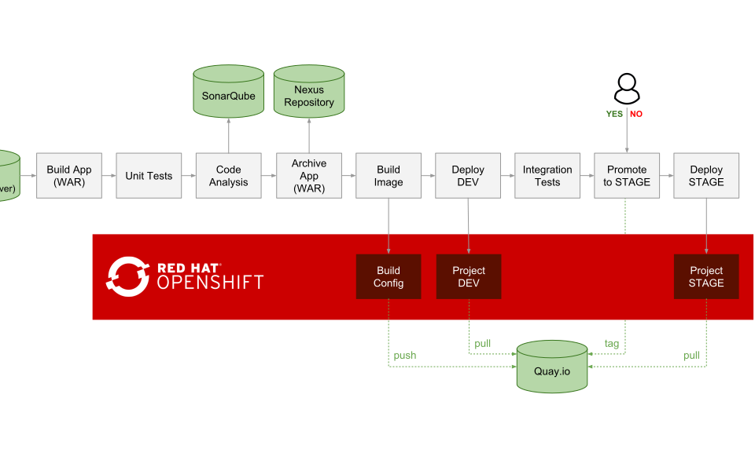

*For other versions of OpenShift, follow the instructions in the corresponding branch e.g. ocp-3.11, ocp-3.10, etc

# CI/CD Demo - OpenShift Container Platform 3.11

This repository includes the infrastructure and pipeline definition for continuous delivery using Jenkins, Nexus, SonarQube and Eclipse Che on OpenShift. 

* [Introduction](#introduction)
* [Prerequisites](#prerequisites)
* [Deploy on RHPDS](#deploy-on-rhpds)
* [Automated Deploy on OpenShift](#automatic-deploy-on-openshift)
* [Manual Deploy on OpenShift](#manual-deploy-on-openshift)
* [Troubleshooting](#troubleshooting)
* [Demo Guide](#demo-guide)
* [Using Eclipse Che for Editing Code](#using-eclipse-che-for-editing-code)


## Introduction

On every pipeline execution, the code goes through the following steps:

1. Code is cloned from Gogs, built, tested and analyzed for bugs and bad patterns
2. The WAR artifact is pushed to Nexus Repository manager
3. A container image (_tasks:latest_) is built based on the _Tasks_ application WAR artifact deployed on WildFly
4. If Quay.io is enabled, the Tasks app container image is pushed to the quay.io image registry and a security scan is scheduled
4. The _Tasks_ container image is deployed in a fresh new container in DEV project (pulled form Quay.io, if enabled)
5. If tests successful, the pipeline is paused for the release manager to approve the release to STAGE
6. If approved, the DEV image is tagged in the STAGE project. If Quay.io is enabled, the image is tagged in the Quay.io image repository using [Skopeo](https://github.com/containers/skopeo)
6. The staged image is deployed in a fresh new container in the STAGE project (pulled form Quay.io, if enabled)

The following diagram shows the steps included in the deployment pipeline:



The application used in this pipeline is a JAX-RS application which is available on GitHub and is imported into Gogs during the setup process:
[https://github.com/OpenShiftDemos/openshift-tasks](https://github.com/OpenShiftDemos/openshift-tasks/tree/eap-7)

## Prerequisites
* 10+ GB memory

## Deploy on RHPDS

If you have access to RHPDS, provisioning of this demo is automated via the service catalog under **OpenShift Demos &rarr; OpenShift CI/CD for Monolith**. If you don't know what RHPDS is, read the instructions in the next section.

## Automated Deploy on OpenShift
You can se the `scripts/provision.sh` script provided to deploy the entire demo:

  ```
  ./provision.sh --help
  ./provision.sh deploy --enable-che --ephemeral # with Eclipse Che
  ./provision.sh delete 
  ```
If you want to use Quay.io as an external registry with this demo, Go to quay.io and register for free. Then deploy the demo providing your 
quay.io credentials:

  ```
  ./provision.sh deploy --enable-quay --quay-username quay_username --quay-password quay_password
  ```
In that case, the pipeline would create an image repository called `tasks-app` (default name but configurable) 
on your Quay.io account and use that instead of the integrated OpenShift 
registry, for pushing the built images and also pulling images for deployment. 
  
## Manual Deploy on OpenShift
Follow these [instructions](docs/local-cluster.md) in order to create a local OpenShift cluster. Otherwise using your current OpenShift cluster, create the following projects for CI/CD components, Dev and Stage environments:

  ```shell
  # Create Projects
  oc new-project dev --display-name="Tasks - Dev"
  oc new-project stage --display-name="Tasks - Stage"
  oc new-project cicd --display-name="CI/CD"

  # Grant Jenkins Access to Projects
  oc policy add-role-to-group edit system:serviceaccounts:cicd -n dev
  oc policy add-role-to-group edit system:serviceaccounts:cicd -n stage
  ```  

And then deploy the demo:

  ```
  # Deploy Demo
  oc new-app -n cicd -f cicd-template.yaml

  # Deploy Demo woth Eclipse Che
  oc new-app -n cicd -f cicd-template.yaml --param=DEPLOY_CHE=true
  ```

To use custom project names, change `cicd`, `dev` and `stage` in the above commands to
your own names and use the following to create the demo:

  ```shell
  oc new-app -n cicd -f cicd-template.yaml --param DEV_PROJECT=dev-project-name --param STAGE_PROJECT=stage-project-name
  ```

# JBoss EAP vs WildFly

This demo by default uses the WildFly community image. You can use the JBoss EAP enterprise images provide by Red Hat by simply editing the 
`tasks` build config in the _Tasks - Dev_ project and changing the builder image from `wildfly` to `jboss-eap70-openshift:1.5`. The demo would work exactly the same and would build the images using the JBoss EAP builder image. If using Quay, be sure not to leave the JBoss EAP images on a publicly accessible image repository. 

## Troubleshooting

* If Maven fails with `/opt/rh/rh-maven33/root/usr/bin/mvn: line 9:   298 Killed` (e.g. during static analysis), you are running out of memory and need more memory for OpenShift.

* If running into `Permission denied` issues on minishift or CDK, run the following to adjust minishift persistent volume permissions:
  ```
  minishift ssh
  chmod 777 -R /var/lib/minishift/
  ```

## Demo Guide

* Take note of these credentials and then follow the demo guide below:

  * Gogs: `gogs/gogs`
  * Nexus: `admin/admin123`
  * SonarQube: `admin/admin`

* A Jenkins pipeline is pre-configured which clones Tasks application source code from Gogs (running on OpenShift), builds, deploys and promotes the result through the deployment pipeline. In the CI/CD project, click on _Builds_ and then _Pipelines_ to see the list of defined pipelines.

    Click on _tasks-pipeline_ and _Configuration_ and explore the pipeline definition.

    You can also explore the pipeline job in Jenkins by clicking on the Jenkins route url, logging in with the OpenShift credentials and clicking on _tasks-pipeline_ and _Configure_.

* Run an instance of the pipeline by starting the _tasks-pipeline_ in OpenShift or Jenkins.

* During pipeline execution, verify a new Jenkins slave pod is created within _CI/CD_ project to execute the pipeline.

* If you have enabled Quay, after image build completes go to quay.io and show that a image repository is created and contains the Tasks app image


* Pipelines pauses at _Deploy STAGE_ for approval in order to promote the build to the STAGE environment. Click on this step on the pipeline and then _Promote_.

* After pipeline completion, demonstrate the following:
  * Explore the _snapshots_ repository in Nexus and verify _openshift-tasks_ is pushed to the repository
  * Explore SonarQube and show the metrics, stats, code coverage, etc
  * Explore _Tasks - Dev_ project in OpenShift console and verify the application is deployed in the DEV environment
  * Explore _Tasks - Stage_ project in OpenShift console and verify the application is deployed in the STAGE environment  
  * If Quay enabled, click on the image tag in quay.io and show the security scannig results 


* Clone and checkout the _eap-7_ branch of the _openshift-tasks_ git repository and using an IDE (e.g. JBoss Developer Studio), remove the ```@Ignore``` annotation from ```src/test/java/org/jboss/as/quickstarts/tasksrs/service/UserResourceTest.java``` test methods to enable the unit tests. Commit and push to the git repo.

* Check out Jenkins, a pipeline instance is created and is being executed. The pipeline will fail during unit tests due to the enabled unit test.

* Check out the failed unit and test ```src/test/java/org/jboss/as/quickstarts/tasksrs/service/UserResourceTest.java``` and run it in the IDE.

* Fix the test by modifying ```src/main/java/org/jboss/as/quickstarts/tasksrs/service/UserResource.java``` and uncommenting the sort function in _getUsers_ method.

* Run the unit test in the IDE. The unit test runs green. 

* Commit and push the fix to the git repository and verify a pipeline instance is created in Jenkins and executes successfully.


## Using Eclipse Che for Editing Code

If you deploy the demo template using `DEPLOY_CHE=true` paramter, or the deploy script and use `--deploy-che` flag, then an [Eclipse Che](https://www.eclipse.org/che/) instances will be deployed within the CI/CD project which allows you to use the Eclipse Che web-based IDE for editing code in this demo.

Follow these [instructions](docs/using-eclipse-che.md) to use Eclipse Che for editing code in the above demo flow.  

# Watch on YouTube

[](https://youtu.be/_xh4XPkdXe0)